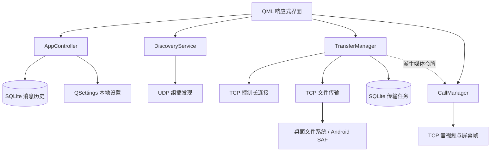
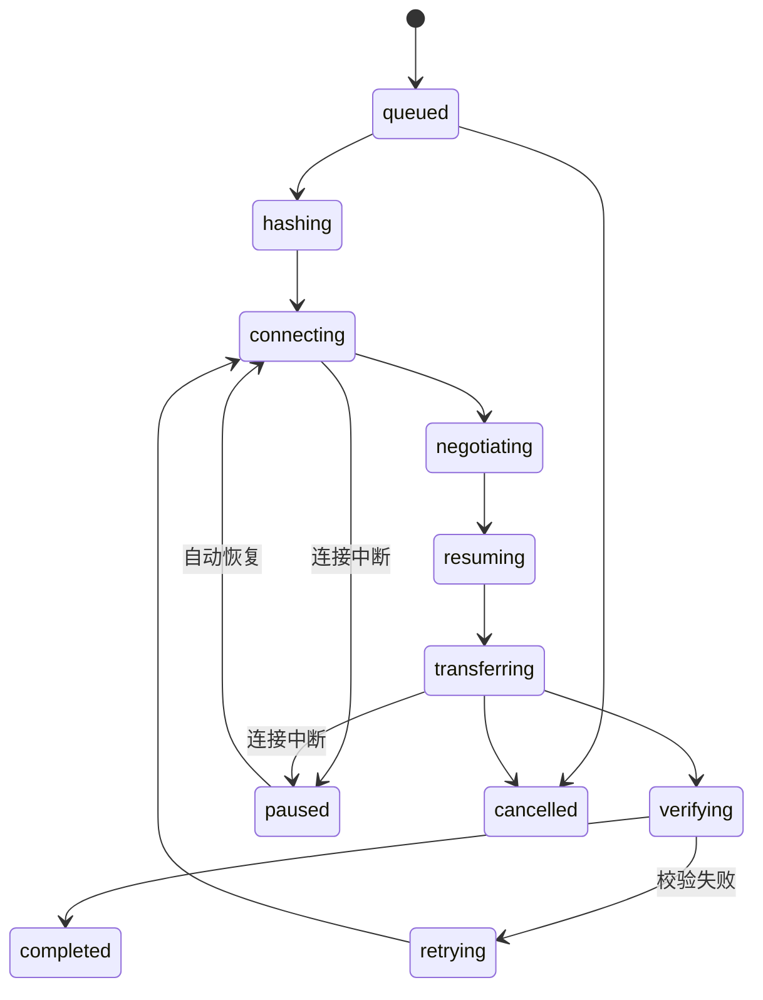

# 系统架构

LanFileTransfer 是一个基于 Qt 6/C++17/QML 的 Windows 与 Android 局域网通信应用。产品不依赖云端服务，设备发现、配对、消息、文件和媒体均在局域网内完成。

## 组件关系

## 主要职责

| 组件 | 职责 |
| --- | --- |
| `AppController` | SQLite 消息历史、QSettings、国际化、桌面托盘、通知和诊断导出 |
| `DiscoveryService` | UDP 组播、网卡变化监听、设备上线/离线维护、Android MulticastLock |
| `TransferManager` | 设备配对、认证长连接、消息、文件队列、续传、SHA-256 校验和可信设备管理 |
| `CallManager` | 摄像头、麦克风、屏幕采集、媒体握手、帧生命周期和连接超时 |
| `TransferStore` | SQLite/WAL 传输任务持久化与恢复 |

## 配对与认证

1. UDP 广播只负责发现设备 ID、地址和服务端口，不直接授予权限。
2. 首次配对生成 256 位随机密钥，并要求接收方人工确认。
3. 重连使用随机挑战和 HMAC-SHA256 证明密钥持有权。
4. 文件报价包含设备 ID、随机挑战、文件元数据和 HMAC。
5. 媒体连接使用从配对密钥单向派生的独立密钥，并进行双向挑战应答。
6. 解除配对会撤销控制、文件和媒体权限，但保留历史消息与已完成文件。

当前协议提供设备认证，但消息、文件和媒体内容仍通过明文 TCP 传输。完整安全边界参见 [connection-state-machine.md](connection-state-machine.md)。

## 文件传输状态

接收端先写入 `.part` 文件；完成后验证 SHA-256，再原子地进入最终路径。Android `content://` 文件通过持久 URI 权限跨重启读取，接收目录通过 SAF 树 URI 写入。

## 平台边界

- Windows：系统托盘、资源管理器打开目录、自包含 `windeployqt` 发布包。
- Android：SAF、前台服务、WakeLock、MulticastLock、运行时媒体权限和 MediaProjection。
- QML：一套界面根据窗口尺寸切换桌面/移动布局，并提供中英文文案。

## 自动验证

- 存储迁移和持久化测试；
- 二进制帧协议测试；
- 两个真实本机 TCP 对端的配对、重连、消息、64 MiB 续传和校验测试；
- 媒体错误密钥、伪造接听、拒接、超时、挂断和画面清理测试；
- 主界面与通话界面 QML 冒烟测试；
- Windows DLL、QML 模块和插件部署完整性检查。

