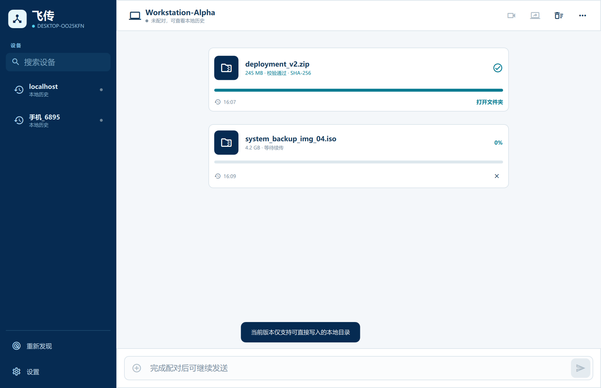
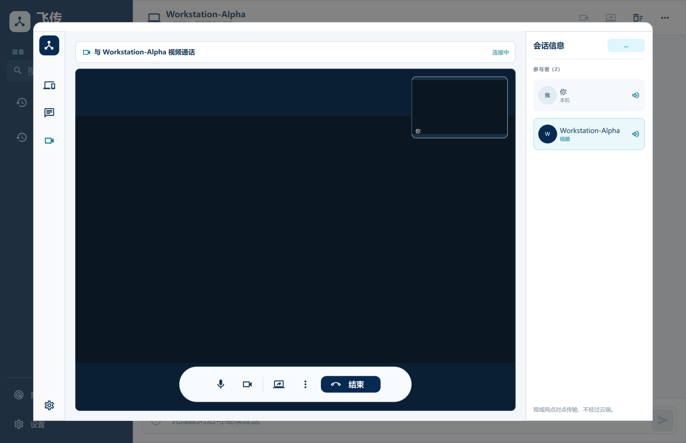
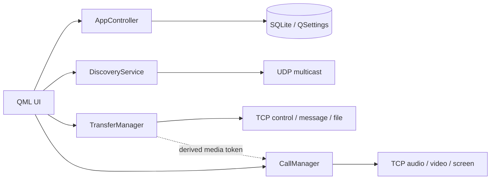

# 飞传 · LanFileTransfer

[](https://github.com/qicecrem/LanFileTransfer/actions/workflows/ci.yml)


飞传是一款使用 Qt 6、QML 与 C++17 开发的 Windows/Android 局域网通信应用。它把设备发现、可信配对、即时消息、大文件续传、视频通话和屏幕共享整合到同一聊天式界面中，不依赖云端服务器。

> 当前定位是作品集与局域网产品原型。身份认证已覆盖控制、文件和媒体链路，但业务内容仍通过明文 TCP 传输，不应在不可信网络中当作端到端加密工具使用。

## 界面

| 文件与消息 | 视频通话与屏幕共享 |
| --- | --- |
|  |  |

## 功能

- UDP 组播自动发现局域网设备，监听网卡和地址变化。
- 设备人工配对、可信设备管理、TCP 控制长连接与指数退避重连。
- 消息和文件共用聊天时间线；未配对时仍可查看 SQLite 离线历史。
- `.part` 文件、持久化任务、非零偏移续传与 SHA-256 完整性校验。
- 摄像头、麦克风和屏幕共享；超时、挂断或撤销权限后清除最后画面。
- 随机挑战与 HMAC-SHA256，认证控制重连、文件报价和媒体握手。
- Windows 系统托盘、自包含 `windeployqt` 发布包和诊断日志导出。
- Android SAF 持久 URI 权限、可选接收目录、前台服务、WakeLock 与 MulticastLock。
- 中英文界面和桌面/移动响应式布局。

## 架构



详细设计见 [系统架构](LanFileTransfer/docs/architecture.md)、[配对状态机](LanFileTransfer/docs/connection-state-machine.md) 与 [传输恢复](LanFileTransfer/docs/transfer-recovery.md)。

## 可靠性设计

### 配对与权限

UDP 广播只提供发现信息，不授予权限。首次配对生成 256 位随机密钥，并要求对端人工确认；后续重连、文件报价和媒体连接均通过随机挑战与 HMAC-SHA256 验证。媒体使用单独派生的密钥，不把原始配对密钥交给 QML。

### 文件恢复

接收文件先写入 `.part`。连接中断后，接收端返回已写入偏移，发送端从该位置继续；完成后进行 SHA-256 校验，只有校验成功才进入最终路径。任务状态保存在 SQLite，应用重启后可恢复。

### Android 生命周期

Android 使用系统文档选择器和持久 URI 权限访问 `content://` 文件。启用后台运行后，前台服务持有 CPU WakeLock 与 Wi-Fi MulticastLock；网络变化时重新枚举接口、加入组播并尝试恢复可信连接。

## 自动测试

当前桌面测试套件包含 7 项：

1. SQLite 传输任务持久化；
2. 二进制协议边界；
3. 配对、重连、消息、64 MiB 中断续传和 SHA-256；
4. 诊断日志；
5. 媒体错误密钥、伪造接听、拒接、超时与挂断；
6. 主界面 QML 冒烟测试；
7. 通话界面 QML 冒烟测试。

2026-09-22 本地 Windows Debug 验证结果：`7/7 passed`。真实 Android 权限、锁屏和切网仍需按 [跨设备验收矩阵](LanFileTransfer/docs/qa-matrix.md) 在目标设备上确认。

## 构建

### Windows

要求 Qt 6.8.3 MinGW 64-bit、CMake 3.16+，以及 Qt Core、Gui、QML、Quick、Network、SQL、Widgets、Multimedia 和 Concurrent。

```powershell
cd LanFileTransfer
./build-desktop.ps1 `
  -QtRoot "C:\Qt\6.8.3\mingw_64" `
  -MinGwBin "C:\Qt\Tools\mingw1310_64\bin" `
  -Configuration Release
```

脚本会配置、编译、运行 CTest、调用 `windeployqt`、验证关键 DLL/插件、启动最终 staging 程序，并在 `LanFileTransfer/dist/` 生成 ZIP 与 SHA-256。

### Android Debug

要求 JDK 17、Android SDK API 36、NDK 26.1.10909125、Qt 6.8.3 Android arm64-v8a 及对应桌面 Host Tools。

```powershell
cd LanFileTransfer
./build-android.ps1 `
  -Configuration Debug `
  -Package Apk `
  -QtAndroidRoot "C:\Qt\6.8.3\android_arm64_v8a" `
  -AndroidSdkRoot "$env:LOCALAPPDATA\Android\Sdk"
```

正式发布必须通过环境变量提供私有签名材料；参见 [完整构建说明](LanFileTransfer/docs/building.md)。密钥、密码和 `keystore.properties` 不得提交。

## 仓库导航

| 路径 | 内容 |
| --- | --- |
| `LanFileTransfer/Main.qml` | 响应式聊天、设置、配对与通话界面 |
| `LanFileTransfer/transfermanager.*` | 配对、消息、文件、续传与校验 |
| `LanFileTransfer/callmanager.*` | 音视频、屏幕共享与媒体认证 |
| `LanFileTransfer/discoveryservice.*` | UDP 发现与网络变化处理 |
| `LanFileTransfer/appcontroller.*` | 历史、设置、托盘、通知与国际化 |
| `LanFileTransfer/tests/` | 单元、集成与 QML 冒烟测试 |
| `LanFileTransfer/docs/` | 架构、协议、诊断、验收和发布文档 |

## 已知限制与后续方向

- TCP 负载尚未使用 TLS；HMAC 只证明身份，不提供内容机密性。
- 视频为 JPEG 帧、音频为 PCM over TCP，适合局域网功能原型，不等同于 WebRTC 商用品质。
- 续传粒度为文件偏移；后续可加入分块哈希与损坏分块重传。
- Android 厂商后台策略不同，正式支持范围需要真机矩阵验证。
- `Main.qml` 与传输管理仍较集中，后续可拆分页面组件和协议/调度服务。

## 许可证

项目代码使用 [MIT License](LICENSE)。Qt、FFmpeg 与 Material Icons 仍受各自许可证约束，详见 [第三方声明](LanFileTransfer/THIRD_PARTY_NOTICES.md)。

